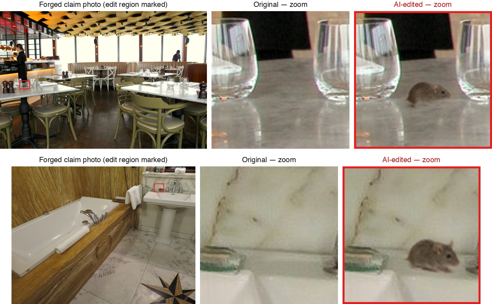
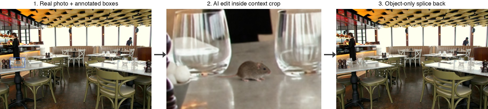

# CLAIMFORGE：动机与实验概览

## 我们在做什么

一句话：**在真实照片的一个小角落里用 AI 插入一个"索赔物证"（老鼠、蟑螂、污渍），拼回原图冒充证据照片——我们构建了第一个针对这种威胁的检测基准（CLAIMFORGE），并系统评测现有的各类检测方法能不能发现它。**

上图是我们数据集里的两个真实样本（上：餐厅；下：酒店浴室）。整张照片 99.7% 的像素来自真实相机拍摄，只有红框内不到 0.4% 的区域被 AI 编辑过。

## Motivation

**1. 这是一个真实且低门槛的欺诈威胁。**
照片是消费纠纷里的事实证据：食客拍到"餐里有虫"可以要求退款、差评、投诉监管；房客拍到"房间有老鼠/损坏"可以索赔。现在的图像编辑模型让伪造这类证据只需要一句 prompt——不需要 P 图技术，不需要生成整张假图，只要在自己拍的真照片里加一只老鼠。受害的是小商家（虚假差评勒索）、平台（仲裁失据）、保险公司和诚实消费者（欺诈成本转嫁）。

**2. 现有检测手段在结构上不适配这种威胁。**
- **整图 AIGC 检测器**（包括 Sightengine、Hive 等商用 API）回答的是"这张图是不是 AI 生成的"。当 99% 以上的像素是真实拍摄时，全局生成痕迹根本不存在。文献已经给出直接证据：INP-X（arXiv:2602.00192）显示，把编辑区域外的像素恢复为原图后，Sightengine 准确率从 92.6% 跌到 55%（接近瞎猜）。
- **传统取证定位模型**（TruFor、CAT-Net 等）依赖拼接边界、双重压缩等痕迹，而我们的构造把真伪两类图做完全一致的后处理，这些捷径被设计上排除。
- **多模态大模型**（GPT、Gemini）在已有评测中对局部编辑的检测和定位都接近随机，且系统性偏向"这是真图"（FragFake, arXiv:2505.15644）。
- **溯源/水印**（C2PA、SynthID）管不住：攻击起点是攻击者自己拍的真照片，本来就没有凭证；开源编辑模型也不打水印。

**3. 没有基准就没有针对性进展。**
现有数据集要么是整图生成（GenImage），要么是通用 inpainting（OpenSDI、TGIF），没有一个针对"消费索赔场景 + 极小语义物体插入 + 像素保持构造"。检测社区看不见这个威胁，就不会去解决它。

## 数据集（已完成构建）

| 项目 | 数值 |
|---|---|
| 标注编辑槽位 | 594（餐厅 297 + 住宿 297） |
| 来源 | Open Images V7 + Wikimedia Commons（可再分发许可） |
| 编辑模型 | HunyuanImage-3（已全量生成；计划再加 FLUX.1-Fill） |
| 插入区域面积 | 中位数仅占整图 **0.232%** |
| 关键性质 | 编辑框外与原图**逐像素一致**（已验证），真伪共享同一最终编码 |

每个样本三步构造（上图）：人工在真实照片上标注插入框与上下文框 → 把上下文 crop 交给图像编辑模型，在框内加入目标物体 → 只把"物体本身的像素"拼回原图。真图与伪图一一同源配对。

## 预期实验（三块）

**E1 主实验 — 现有方法全景评测（核心表格）。**
约 20 个检测器、四个范式，全部零样本（开箱即用权重），在两个任务上打分：
- **T1 检测**：整图是真是假（AUC、AP、固定阈值准确率、5% 误报率下的召回）；
- **T2 定位**：指出被编辑的像素区域（pixel F1 / IoU / 框级命中率）。

四个范式：① 取证定位模型（TruFor、CAT-Net、MVSS-Net、PSCC-Net、IML-ViT、Mesorch、SAFIRE、RelayFormer）；② 整图 AIGC 检测器（CNNDetection、UniversalFakeDetect、NPR、Effort、Community Forensics）；③ inpainting 专用检测器（MaskCLIP/OpenSDI）；④ 商用 API（**Sightengine**：成熟商业整图检测基线；**Illuminarty**：唯一带区域定位输出的商用服务）与多模态大模型（GPT-5.5、Gemini 3.1 Pro、FakeShield）。

预先声明"解决线"：image AUC ≥ 0.90 **且** pixel F1 ≥ 0.50，且经 JPEG-75 再压缩后仍成立。**预期结论：没有任何现成方法达标。**

**E2 鲁棒性 — 现实传播条件下的退化曲线。**
伪造照片到达审核员手里前会经过压缩和转发。我们对真伪两类图施加同样的 laundering（JPEG 质量 95→50、缩放、社交媒体转发模拟共 8 个条件），画出每个方法的性能退化曲线。

**E3 诊断与对照 — 让结论无法被质疑。**
- **整图 vs 局部对比**：同一批检测器在"同域整图 AI 图"上表现良好、在我们的局部编辑上崩塌——证明不是检测器烂，是威胁模型变了；
- **真实物体贴回对照**：用真老鼠抠图走同一拼接管线，区分检测器抓的是"AI 纹理"还是"贴图痕迹"；
- **真实含虫照片对照**：防止"看到老鼠就判假"的语义捷径；
- **格式/元数据探针**：证明数据集本身没有可作弊的构造捷径；
- **切片分析**：按场景域、物体面积等拆分，画"插入面积 vs 可检测性"曲线。

## 产出与投稿

- 投稿目标：**AAAI-27 AI for Social Impact (AISI) track**（全文截止 2026-07-28）；
- 公开发布：数据集（gated，研究用途）+ 全部评测代码与逐方法结果；
- 论文核心主张：在"像素保持局部编辑"这一现实欺诈威胁下，从经典取证、AIGC 检测、商用服务到前沿大模型，**现有检测生态整体失效**——这是平台信任与安全团队今天就该知道的事。
